# Large Graph Path Finder (LGPF)

## Table of Contents

- [Abstract](#abstract)
- [Algorithms & Heuristics](#algorithms--heuristics)
- [Installation](#installation)
- [Quick Start](#Quick--Start)
- [Prerequisites](#prerequisites)
- [Environment & Versions](#environment--versions)
- [Usage](#usage)
- [Testing](#testing)
- [Benchmarking](#benchmarking)
- [Documentation](#documentation)
- [AI Usage](#ai--uage)
- [Project Structure](#project-structure)
- [Future Work](#future-work)
- [Known Bugs](#known-bugs)

---

## Abstract

The **Large Graph Path Finder (LGPF)** project benchmarks and evaluates multiple pathfinding algorithms on arbitrarily large graphs. It supports uninformed search (BFS, DFS, Depth-Limited), weighted search (Dijkstra, Bidirectional Dijkstra), informed search (Greedy Best-First, A*), and advanced heuristics including **ALT (A* with Landmarks and Triangle inequality)**. For graphs containing negative edge weights, the system falls back to **Bellman–Ford** .

Graphs are generated in JSON format and preprocessed to build fast lookup structures, detect uniform weights, and compute landmark tables for ALT on large graphs. During preprocessing, a **real-time timer and memory monitor** report progress directly to the terminal and log file, warning if runtime exceeds 60 seconds or memory usage exceeds 1 GB. Queries can then be executed from file or interactively, producing exact path costs and performance statistics

---

## Algorithms & Heuristics

### Used Algorithms & Heuristics

Pathfinding in large graphs requires balancing **accuracy** , **speed** , and **scalability** . In `pathfinder.py`, the algorithm is chosen automatically based on graph properties:

* If landmarks exist → **A* + ALT [USING]**
* If negative weights exist → **Bellman–Ford [USING]**
* If graph is very large → **A* (Zero Heuristic) [USING]**
* If graph is unweighted → **BFS [USING]**
* Otherwise → **Dijkstra [USING]**

This adaptive design ensures that queries are solved efficiently and correctly without the user having to manually choose the algorithm.

---

### Uninformed Search

* **BFS (Breadth-First Search) [USING]**
  * *Use* : Unweighted graphs.
  * *Pros* : Finds shortest path in edge count.
  * *Cons* : High memory, ignores weights.
* **DFS (Depth-First Search)**
  * *Use* : Reachability checks.
  * *Pros* : Simple, low memory.
  * *Cons* : Not optimal, may miss goal in deep graphs.
* **Depth-Limited DFS**
  * *Use* : Same as DFS but avoids infinite paths.
  * *Pros* : Bound search depth.
  * *Cons* : Still not guaranteed optimal.

---

### Weighted Graph Algorithms

* **Dijkstra [USING]**
  * *Use* : Weighted graphs, no negative edges.
  * *Pros* : Guarantees shortest path.
  * *Cons* : Slower for very large graphs.
* **Bidirectional BFS**
  * *Use* : Unweighted graphs, source–goal pairs.
  * *Pros* : Faster in practice than BFS.
  * *Cons* : Only works on unweighted graphs.
* **Bidirectional Dijkstra**
  * *Use* : Large weighted graphs.
  * *Pros* : Can halve search space.
  * *Cons* : Not fully optimized in current code.
* **Bellman–Ford [USING]**
  * *Use* : Graphs with negative edge weights.
  * *Pros* : Correct with negatives.
  * *Cons* : Very slow (O(VE)).

---

### Informed Search

* **Greedy Best-First Search**
  * *Use* : Uses heuristic only (H).
  * *Pros* : Fast, goal-directed.
  * *Cons* : Not optimal.
* **A* [USING]**
  * *Use* : Weighted graphs with heuristics.
  * *Pros* : Optimal if heuristic is admissible.
  * *Cons* : Needs good heuristic, otherwise same as Dijkstra.

---

### Heuristics

* **Zero Heuristic [USING]**
  * *Pros* : Always admissible, safe.
  * *Cons* : Reduces A* to Dijkstra.
* **Manhattan**
  * *Use* : Grid-like graphs.
  * *Pros* : Simple, consistent.
  * *Cons* : Only makes sense on grids.
* **Euclidean**
  * *Use* : Spatial graphs.
  * *Pros* : Geometrically intuitive.
  * *Cons* : Less useful on abstract graphs.
* **Chebyshev / Octile**
  * *Use* : Grid movement with diagonals.
  * *Pros* : Models 8-directional movement.
  * *Cons* : Not needed in non-grid graphs.
* **Haversine**
  * *Use* : Geographic (lat/lon).
  * *Pros* : Real-world Earth distance.
  * *Cons* : Costly, only relevant to maps.
* **ALT (A* + Landmarks + Triangle inequality) [USING]**
  * *Use* : Very large graphs.
  * *Pros* : Strong admissible heuristic, massive speedups for queries.
  * *Cons* : Preprocessing is expensive (runs many Dijkstras)

#### **Uninformed Search**

* **BFS (Breadth-First Search)**
  * *Use* : Unweighted graphs.
  * *Pros* : Simple, guarantees shortest path in terms of edges.
  * *Cons* : Inefficient for large weighted graphs.
* **DFS (Depth-First Search, Depth-Limited)**
  * *Use* : Exploratory only, not used in weighted shortest-path.
  * *Pros* : Low memory footprint, useful for reachability.
  * *Cons* : Does not guarantee shortest path.

---

#### **Weighted Algorithms**

* **Dijkstra**
  * *Use* : Weighted graphs with non-negative edges.
  * *Pros* : Guarantees optimal paths, robust for medium graphs.
  * *Cons* : Slower for very large graphs; expands many nodes.
* **Bidirectional Dijkstra**
  * *Use* : Large graphs with a clear source-target pair.
  * *Pros* : Faster in practice by searching from both ends.
  * *Cons* : More complex implementation; not always optimal in sparse graphs.
* **Bellman–Ford**
  * *Use* : Graphs with negative edge weights.
  * *Pros* : Handles negative edges safely, guarantees correctness.
  * *Cons* : Very slow (O(VE)), not suitable for large graphs unless required.

---

#### **Informed Algorithms**

* **Greedy Best-First Search**
  * *Use* : Heuristic-based exploration.
  * *Pros* : Very fast, explores promising nodes first.
  * *Cons* : Not guaranteed to find optimal path.
* **A** *
  * *Use* : Weighted graphs with admissible heuristics.
  * *Pros* : Guarantees optimal paths, faster than Dijkstra if heuristic is strong.
  * *Cons* : Requires a good heuristic; fallback is same as Dijkstra if heuristic=0.

---

#### **Heuristics**

* **Zero Heuristic**
  * *Pros* : Safe, guarantees correctness.
  * *Cons* : Reduces A* to Dijkstra.
* **ALT (A* with Landmarks and Triangle inequality)* *
  * *Use* : Very large graphs (≥10k nodes).
  * *Pros* : Strong admissible heuristic, greatly reduces search space; queries become very fast after preprocessing.
  * *Cons* : Preprocessing cost is high (multiple Dijkstra runs for each landmark).

## Installation

No installation step is required — just ensure prerequisites are installed see [Prerequisites](#prerequisites) and tested [Environment & Versions](#environment--versions) all other OS is risk of the user.

---

## Quick Start

*note: this program is designed to run on Linux/Linux VMs OS, other OS is not fully supported, certain commandline is gear thorse the OS mentioned see [Prerequisites](#prerequisites)*

1. See [Usage](#usage) and its subsection `3. Required files to run` then `4. Run the Path Finder *main program*`

## Prerequisites

The program runs on **Python 3.13+** and does not require installation beyond having the correct dependencies available.

* **Python** : ≥ 3.13 (tested on 3.13.5)
* **pip** : ≥ 25.0 (tested with 25.2)
* **Operating Systems Tested** :
  * Windows 11 Pro for Workstations
  * Ubuntu 25.04 (inside VirtualBox)
* **Required Libraries** :
  * `networkx` (graph handling)
  * `matplotlib` (visualization)
  * `psutil` (timer & memory monitor)
  * `pytest` (testing framework)

Optional but supported:

* `pandas` / `scipy` for extended analysis
* `graphviz` for extra visualization format

---

## Environment & Versions

* **Python Version** : 3.13.5
* **pip Version** : 25.2
* **OS** : Windows 11 Pro for Workstations; Ubuntu 25.04 (VirtualBox)
* **Key Packages** :

  * `networkx 3.5`
  * `matplotlib 3.10.6`
  * `psutil 7.1.0`
  * `pytest 8.4.2`
* **Memory Tested** : Preprocessing up to ~1 GB RAM (monitored with psutil)
* **Hardware Used** : Intel Core i9 13980HX(24/32), 96 GB RAM

---

## Usage

### Run Main Program

#### 1. Generate Graphs (Optional, if and only if sub section 3. Required files to run are satisfied)


Use the provided generator to create test graphs in JSON:

```bash
# Example: 20k vertices, 60k edges
python3 example/generators/graph-generator.py \
  --num_vertices 20000 \
  --num_edges 60000 \
  --min_weight 1 \
  --max_weight 100 \
  --json_out input/large_graph.json \
  --img_out input/large_graph.png \
  --seed 42
```

#### 2. Generate Queries

Where to locate generator Python files under program root *example/generators*:

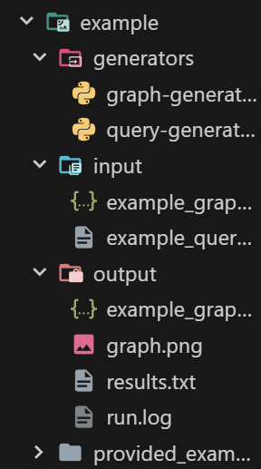

Create source–target pairs to test algorithms:

```bash
python3 example/generators/query-generator.py \
  --graph input/medium_graph.json 
  --out input/medium_queries.txt 
  --count 500 
  --seed 0
```

or generate nodes that are all reachable *note: good luck on tring to perform 10K node on personal machines. generator will provide node pairs*:

```bash
python3 example/generators/query-generator.py \
  --graph input/medium_graph.json
  --out input/medium_reach.txt
  --count 500
  --seed 0
  --reachable-only
```

#### 3. Required files to run

*note: exsample files can be obtained in `exsample/input` or generate see this subsection 1 and 2*

1. `<graph>.json` file required and insert it in `input/`
2. `query.txt` file optional and insert it in `input/`

#### 4. Run the Path Finder *main program*

Launch the main program *note: this program is designed to run on Linux/Linux VMs OS, other OS is not fully supported, certain commandline is gear thorse the OS mentioned see [Prerequisites](#prerequisites)*:

```bash
python3 -m core.main
```

or use quick script *note: user must be under root directory*.

```bash
./run.sh
```

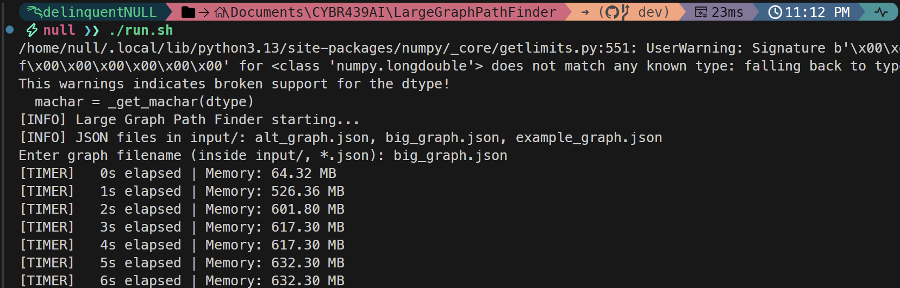

You’ll be prompted to select:

- A graph file (e.g. input/large_graph.json)
- A query file `after preprocessing is complete`(e.g. input/large_queries.txt)

  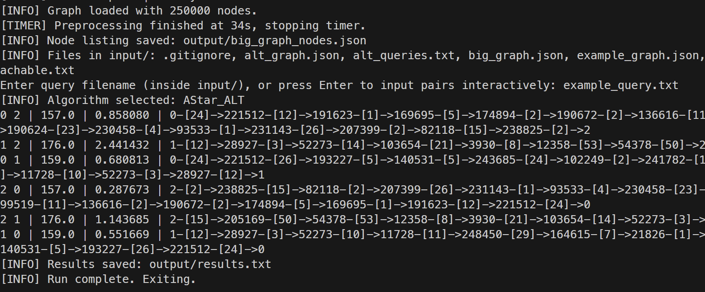

#### 5. Real-Time Timer & Memory Monitor

During preprocessing:

- timer counts up in seconds
- memory usage is displayed
- warnings appear if:
  - Runtime exceeds 60s
  - Memory usage exceeds 1024 MB

Example:

```csharp
[TIMER]   0s elapsed | Memory: 64.31 MB
[TIMER]   1s elapsed | Memory: 531.61 MB
...
[TIMER] Preprocessing finished at 35s, stopping timer.
```

#### 6. Results

Output contains after a success or partial successful run:

- Query results are printed in terminal and saved to `output/results.txt`. Each line shows source, target, path cost, and runtime. If no path exists, cost will be inf.
- Query outputs are written to `output/results.txt`
- Program logs as `run.log
- A viasual graph if and only if node is no more than 1000 nodes.
- A json file showing all the proccessed nodes

  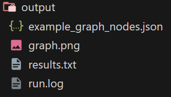

  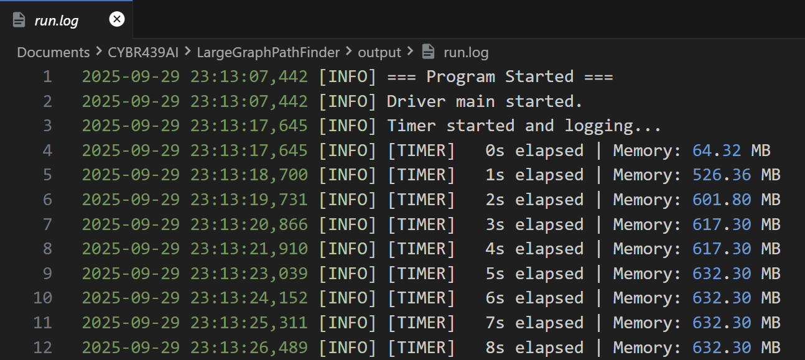

  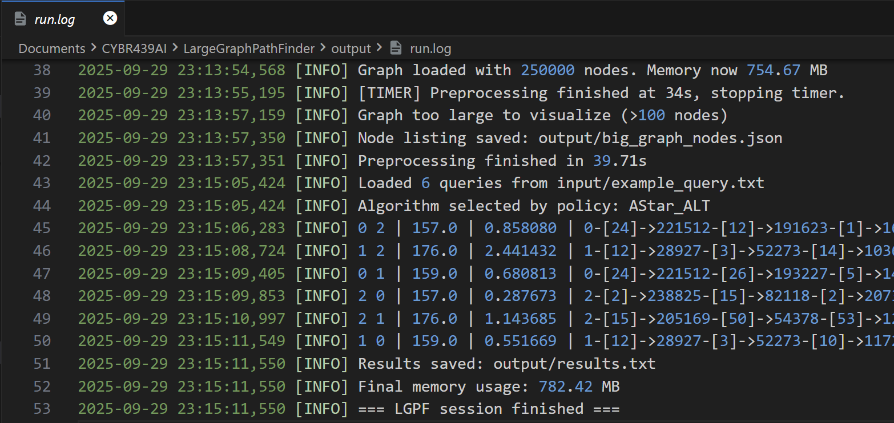

#### 7. Benchmarking (Optional)

*note: see [Benchmarking](#benchmarking) for deeper details*

1. Run all unit tests and benchmarks it will create `tests/results/benchmark_result.txt` see [Testing](#testing) on how to run tests.
2. or Generate plots at root directory:
   ```bash
   python3 tests/plot_benchmarks.py
   ```
3. Charts are saved in `tests/results/benchmark_plot_<name>_graph.png`.

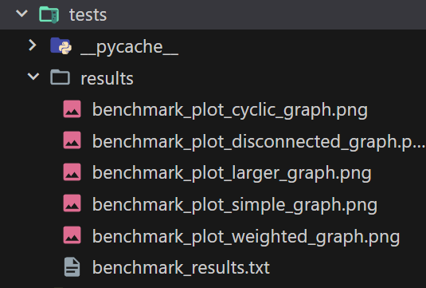

---

## Testing

Unit tests are provided under `tests/<test_test_file_name>.py`.
Run with:

This project uses **pytest** for automated unit tests and benchmarks.

### Running All Tests

Run all unit tests and benchmarks with *note: must be under root folder*:

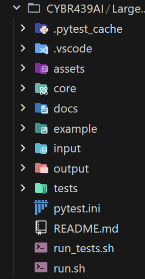

```bash
pytest -v
```

or use the helper script:

```bash
./run_tests.sh
```

This will execute all test cases under *tests/* and run benchmark comparisons across algorithms.

Save benchmark results into *tests/results/benchmark_results.txt*

Benchmark Plotting
After benchmarks are generated, you can visualize results see [Benchmarking](#benchmarking).

---

## Benchmarking

Benchmarking evaluates how each algorithm performs across different graph types.
This helps us compare runtime efficiency, path costs, and algorithm suitability.

### Running Benchmarks

Run the benchmarks directly with Python:

```bash
python3 tests/benchmark.py
```

Or use the convenience script:

```bash
./run_tests.sh
```

Both commands will execute all algorithms against predefined graphs (simple_graph, weighted_graph, cyclic_graph, etc.) and store results in: *output/benchmark_results.txt*

### Example Results

Below is a snippet of results from benchmark_results.txt:

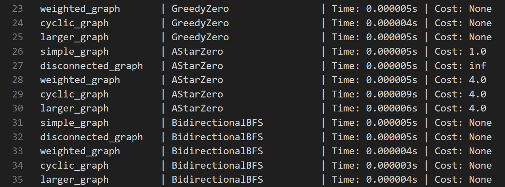

### Benchmark notations and meaning

- Time → Runtime of the algorithm on that graph.
- Cost → Path cost from source to target:
- A number (e.g., 4.0) means a path was found.
- inf means no path exists between source and goal.
- None means the algorithm doesn’t compute costs in that context (e.g., plain BFS for reachability).

### Visualization

You can visualize algorithm performance (runtime vs. cost) using matplotlib:

```bash
python3 tests/plot_benchmarks.py
```

This produces a chart comparing algorithms across test graphs, saved under *tests/results/benchmark_plot.png*.

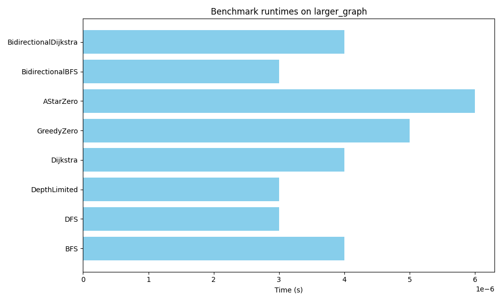

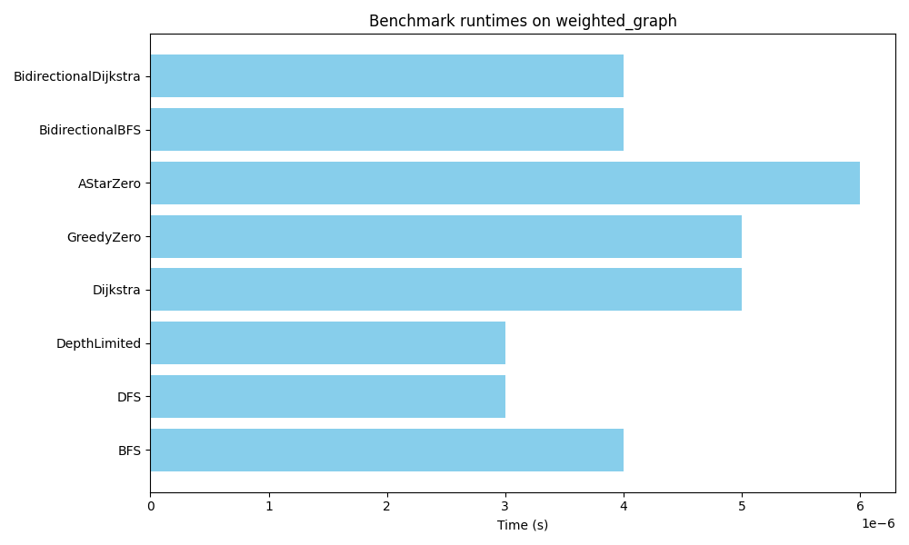

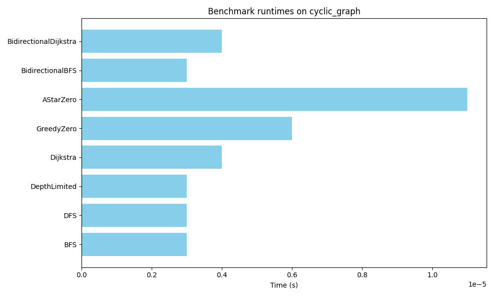

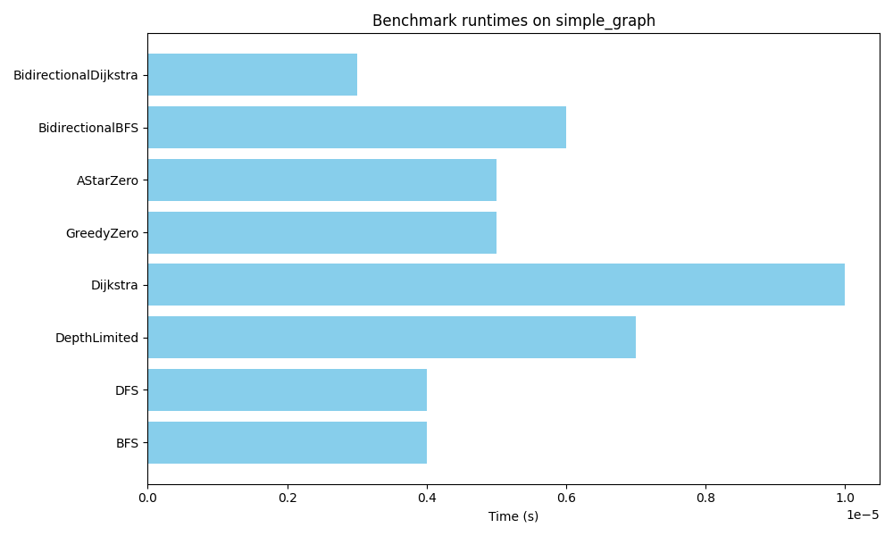

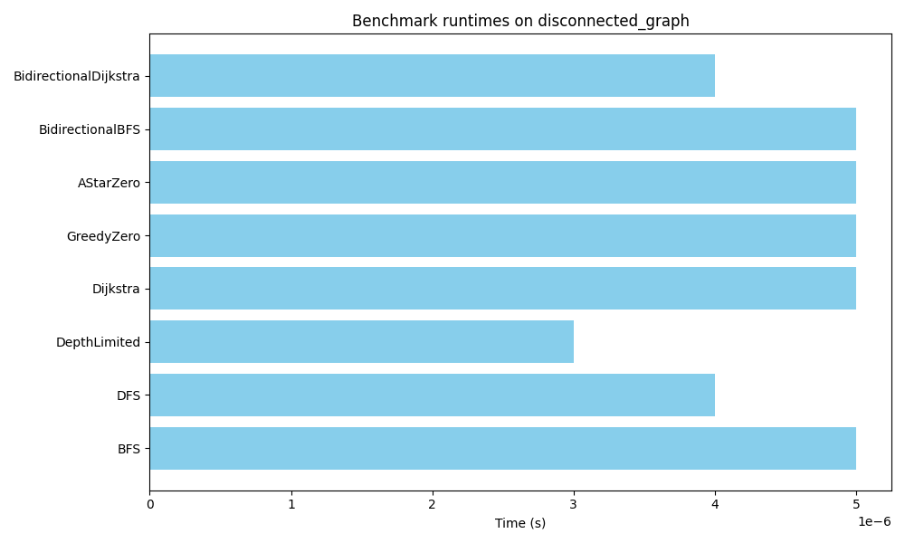

---

## Documentation

- Development log: [`docs/ai_chat_log.md`](docs/ai_chat_log.md)
  Contains incremental notes on implementation choices, code summaries, and next steps.

---

## AI Usage

* AI is used through out the development process. Mostly auto-complete feature with VS Code GitHub Copilot
* For code intergration and advice Open-AI ChatGPT 5 is used see project_root/docs/*ai_chat_log.md* for prompt and scripts.

  [20250930_000502_ai_chat_log.md](assets/20250930_000502_ai_chat_log.md)

## Project Structure

```
LargeGraphPathFinder/
├── .pytest_cache/   # Pytest cache
├── .vscode/         # VS Code configuration
├── assets/          # Used to store README photos
├── core/            # Main source code
├── docs/            # Documentation (ai_chat_log.md, etc.)
├── example/         # input and out generator is located here too
├── input/           # User-provided JSON graphs
├── output/          # Program-generated query files & logs
├── tests/           # Unit tests + benchmarks
├── pytest.ini       # Pytest configuration
├── README.md        # This file
├── README.pdf       # Pandoc converted PDF version of this file
├── run_test.sh      # Launcher script for all tests
├── run.sh           # Launcher script
└── pytest.ini       # Pytest configuration
```

---

## Future Work

- Increase performance across the board
- Code refactoring and efficenecy
- Scale ALT preprocessing to millions of nodes with smarter landmark selection
- Parallel preprocessing (multi-core Dijkstra)
- Cluster-based heuristics for very large graphs
- Web-based visualization for graphs >10k nodes
- Incremental memory-usage profiling

---

## Known Bugs

* [quality of life] Every time program run output does not replace or append old output files automatically. [workaround] make sure new run delete old output files or save it in another location.
